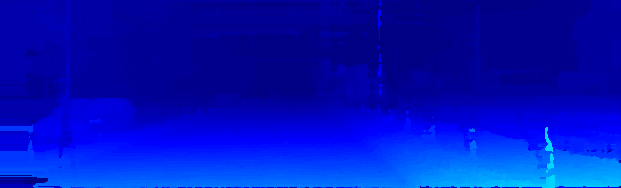
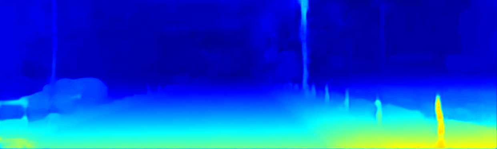

# sRRNet

Implemented a lightweight coarse-to-fine stereo matching framework optimized for embedded GPUs, 
enabling efficient and accurate depth estimation under constrained computational resources.

### input


### output


## 📦 Requirements

Install the following packages before running the code:

```bash
pip install tensorflow-GPU==1.9.0
pip install opencv-python
pip install numpy
any other requirements
```
⚠️ This project was completed in September 2020, and therefore relies on older versions of some function libraries.


Also, make sure you have:

- Python 2.7+ ()
- GPU-enabled environment with CUDA/cuDNN support (for training)

## Directory Structure

```
sRRNet/
├── config/              # JSON configuration files for training/testing
│   ├── training.json
│   └── testing.json
├── data/                # JSON configuration files for training/testing
│   ├── train
│   │   ├── disp         # Quarter size of initial disparity, that obtained by [z2zncc](https://github.com/changqiong/z2zncc)
│   │   ├── gt
│   │   ├── gt_noc
│   │   └── mini_left    # Original size of left image 
│   └── test
│       ├── disp         # Quarter size of initial disparity, that obtained by [z2zncc](https://github.com/changqiong/z2zncc)
│       ├── mini_left    # Quarter size of left image
│       └── test_left    # Original size of left image 
├── model/               # Folder to save or load trained models
├── result/              # Folder to save output images during testing
├── main.py              # Main training/testing script
├── tfmodel.py     	 # Model architecture
├── data_loader.py       # Custom dataloader
├── utils.py             # Utility functions (if any)
└── README.md            # This file
```

## 🚀 Run

### Training

To start training, run:

```bash
python main.py --config ./config/training.json
```

This will train the model and save checkpoints in `./model/`.

### Testing

To test a model, run:

```bash
python main.py --config ./config/testing.json --model ./model/{model.name} --mode test
```

Replace `{model.name}` with your actual model file, e.g., `model-90000.meta`.

### Output

- Prediction results are saved in the `result/` folder.
- Logs and intermediate results are printed to console.


## Related Publications

> Chang, Qiong, et al. 
> "TinyStereo: A Tiny Coarse-to-Fine Framework for Vision-Based Depth Estimation on Embedded GPUs."
> IEEE Transactions on Systems, Man, and Cybernetics: Systems (2024).
---

## What to Cite

If you use this code for academic purposes, please cite the following paper:

```bibtex
@article{chang2024tinystereo,
  title={TinyStereo: A Tiny Coarse-to-Fine Framework for Vision-Based Depth Estimation on Embedded GPUs},
  author={Chang, Qiong and Xu, Xin and Zha, Aolong and Er, Meng Joo and Sun, Yongqing and Li, Yun},
  journal={IEEE Transactions on Systems, Man, and Cybernetics: Systems},
  year={2024},
  publisher={IEEE}
}
```

---

## 💡 Notes

- Code uses `tf.ConfigProto` with `allow_growth=True` to prevent full GPU memory allocation.
- The dataset must be preprocessed (e.g. by [z2zncc](https://github.com/changqiong/z2zncc))in advance and stored in the paths specified in the config file.
- The model is optimized for small-scale stereo refinement; you may adapt it for larger datasets or integrate it into existing stereo pipelines.


## License

This project is released under the [MIT License](LICENSE).

---